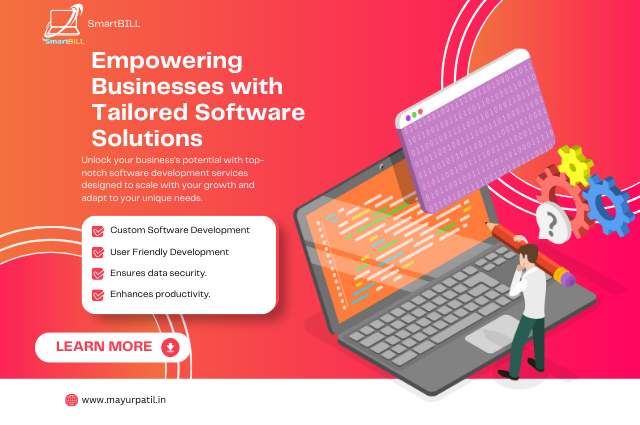
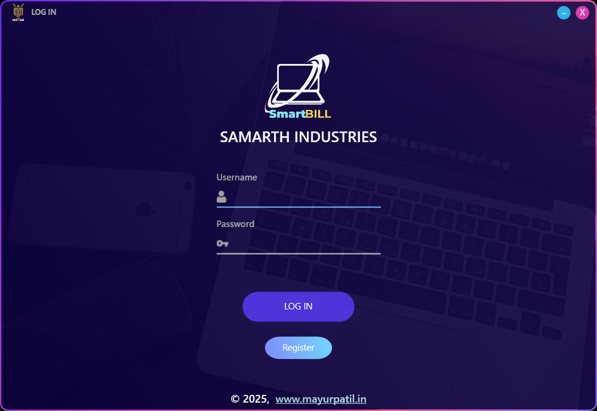

# SmartBILL_Desktop_Application
SmartBILL software built with C#, WPF MVVM, .NET 4.8.1, SAP Crystal Report SP 37, and SQL Server 16. This solution provides a user-friendly interface for efficient billing, integrated reporting, and seamless data management. Ideal for businesses looking to streamline their billing process using modern and reliable technologies.



# 🎯 Project Overview
**Technologies Used:**
- C# and WPF MVVM: For an intuitive and dynamic user interface.
- .NET Framework 4.8.1: For robust application performance.
- SAP Crystal Report SP 37: For advanced reporting capabilities.
- SQL Server 16: For secure and efficient data management.

**Features:**
- User-friendly interface for seamless navigation.
- Integrated reporting with customizable templates.
- Real-time data synchronization and secure storage.
- Scalable solution to meet business growth.

**Benefits:**
- Streamlines billing processes and reduces manual errors.
- Enhances productivity with automated reporting.
- Ensures data security and reliability.

**Ideal For:**
- Small to medium-sized businesses seeking a professional and efficient billing solution.

## 👤 Register


## 👨‍💻 Login


## 💻 Dashboard


## ⚙️ Requirements
> [!IMPORTANT]

**Basics:**
- .NET Framework 4.8.1
- SAP Crystal Report SP 37
- SQL Server 22
- FontAwesome
	- ```Install-Package FontAwesome.Sharp```
- Entity Framework
	- ```Install-Package EntityFramework ```
	- ```enable migration```
	- ```Add-Migration InitialCreate ```
	- ```Update-Database ```
	      
				
	
	 